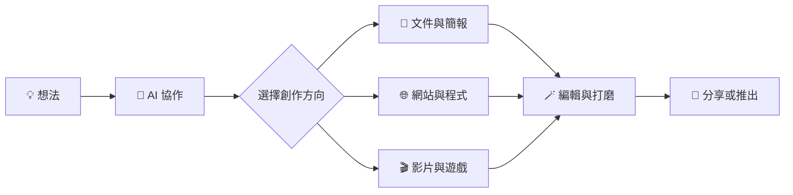

# manus ai

<div align="center">

[](https://cue.im/)
[](https://cue.im/)
[](https://cue.im/)

# ✦ Cue Studio

### **Your ideas deserve more than a blank page.**

一個讓你與 AI 並肩創作、修改、打磨並推出成果的工作空間。

[🚀 開始創作](https://cue.im/)

</div>

---

> [!TIP]
> **從一句想法，到真正能使用的作品。**
> 讓 AI 協助你跨過空白頁、繁瑣步驟與反覆重做；你掌握方向，也能親手調整每個細節。

## ✧ 一個工作區，多種創作路徑



## 🛠️ 為工作帶上合適的專業工具

| 創作方向 | 從想法到成果 |
| --- | --- |
| **文件與簡報** | 起草、整理、製作文件、試算表、PDF 與簡報。 |
| **網站與程式** | 把需求整理成網站、網頁應用或程式專案，並持續迭代。 |
| **影片** | 先做出初版，再在時間軸調整片段、圖片、文字、動態圖像與音訊。 |
| **遊戲** | 從可玩的起點開始，調整程式、素材、角色與場景，再分享成果。 |
| **你的檔案與工具** | 從既有資料出發，在授權的工作環境中延續專案。 |

## 🎬 Video Editor — 創作不必從頭再來

初版完成後，影片仍然可以逐段細修。替換畫面、改動文字、調整動畫或音樂，再預覽、匯出；想換個方向，也可以請 AI 根據你的修改繼續調整。

> **先有一版，再把它變成你的版本。**

## 🎮 Game Dev — 把腦海中的玩法做出來

從可玩的範本開始，把構想一步步變成能操作的遊戲。你可以查看執行中的作品、整理素材、調整程式與場景，再把完成的遊戲分享給別人一起體驗。

## 🖥️ 你專心工作，AI 在自己的工作區協助

在已連線且獲授權的電腦工作階段中，AI 可以使用你核准的檔案、瀏覽器與應用程式完成任務；你能查看它的工作狀態，也可以在需要時接手。透過手機交代工作，回到桌面時再接續成果。

> [!IMPORTANT]
> 電腦操作、帳戶連線與發佈功能，會依你授權的環境、可用工具及產品設定而有所不同。分享或推出作品前，請先檢查內容與公開範圍。

## ✨ 讓創作流程動起來

- [x] 描述你想做的成果
- [x] 讓 AI 幫忙起草、建立或整理第一版
- [ ] 在工作區檢視並調整細節
- [ ] 確認成品後再分享或推出

<details>
<summary><strong>展開：你可以怎麼開始</strong></summary>

<br>

```text
「幫我把這個產品構想整理成一份簡報，先做出清楚的故事線。」

「把這些筆記變成一頁可以分享的網站，保留簡潔、明亮的風格。」

「先做一段影片初版，然後讓我能替換片段、文字和音樂。」

「從這個遊戲點子開始，做一個可以實際操作的原型。」
```

</details>

---

<div align="center">

### **Imagine it. Shape it. Make it real.**

[](https://cue.im/)

<sub>你的方向，你的細節，你的作品。</sub>

</div>
