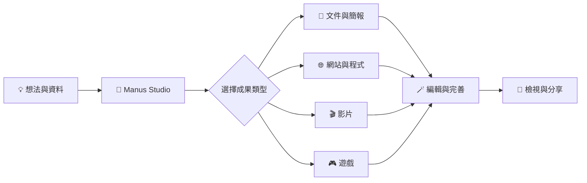

# manus ai

<div align="center">

[](https://manus.im/desktop)
[](https://manus.im/desktop)
[](https://manus.im/desktop)

# ✦ Manus Studio

### **想法不只停在空白頁，讓它開始成為作品。**

Manus Studio 是一個讓人與 AI 在同一工作區建立、編輯與推進成果的創作環境。

[🚀 探索 Manus Studio](https://manus.im/desktop)

</div>

---

> [!TIP]
> **從想法出發，在同一個工作區把成果做出來。**
> 整理資料、建立初稿，再繼續編輯與打磨；你決定方向，也能檢視每一步成果。

## ✧ 一個工作區，多種創作方向



## 🛠️ 從文件到互動作品

| 創作方向 | 可以在工作區推進的成果 |
| --- | --- |
| **文件與資料** | 建立或整理文件、試算表、PDF 與簡報。 |
| **網站與程式** | 將構想轉成網站、網頁應用或程式專案，再持續調整。 |
| **影片** | 製作影片，並使用 Video Editor 繼續編輯。 |
| **遊戲** | 從遊戲構想開始製作，並透過 Game Dev 推進遊戲作品。 |
| **工作區協作** | 在 Manus Studio 中與 AI 一起建立和編輯成果；依需求使用相關檔案與工具。 |

以上是 [Manus 2.0 與 Manus Studio 的官方介紹](https://manus.im/blog/introducing-manus-2-0)所列的創作方向；實際可用功能依產品版本與工作環境而異。

## 🎬 Video Editor — 影片做好初版，還能繼續打磨

Manus Studio 提供 Video Editor，讓影片創作不只停在第一版。你可以在工作區繼續調整與完善影片，再檢視成果。

> **先做出初版，再把細節修成你要的樣子。**

## 🎮 Game Dev — 把遊戲構想推進成作品

從玩法構想出發，逐步建立遊戲成果。透過 Game Dev 延續創作、檢視作品並進行調整，讓想法有機會成為可體驗的遊戲。

## 🖥️ 人與 AI，共用一個創作工作區

Manus Studio 的定位是人與 AI 一起建立、編輯與推出成果的工作空間。你可以在工作區檢視產出、決定修改方向，並在分享之前確認作品內容。

> [!IMPORTANT]
> 可用的工作流程與功能會依 Manus 產品版本、帳戶設定及工作環境而異；分享或推出作品前，請先檢查內容與公開範圍。

## ✨ 讓想法開始成形

- [x] 說明你想完成的成果
- [x] 讓 Manus 協助建立第一版
- [ ] 在工作區檢視並調整細節
- [ ] 確認成果後再分享或推出

<details>
<summary><strong>展開：可以這樣開始</strong></summary>

<br>

```text
「把這些資料整理成一份易讀的簡報，先建立清楚的內容架構。」

「把這個產品構想做成一頁網站，採用明亮、簡潔的視覺風格。」

「替這個主題製作一段影片，並讓我能繼續編輯成果。」

「從這個遊戲點子開始，逐步做出可以體驗的作品。」
```

</details>

---

<div align="center">

### **Imagine it. Shape it. Make it real.**

[](https://manus.im/desktop)

<sub>你的方向，你的細節，你的作品。</sub>

</div>
